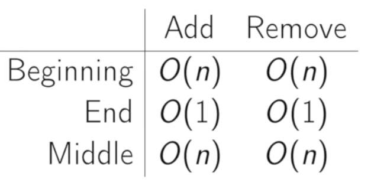

# Array

## Definition

>Contiguous area of memory consisting of equal-size elements indexed by continguous integers.

## Timing

Read: O(1)
Write: O(1)

constant-time access: array address + element size * (i - first index)
> i.e. read index 4th value (assume 0 based indexing with starting address at 128 and an element size of 32 bits)
> address = 128 + 32(4 - 0)

### Common Operations

## Row Major Indexing

Think of a multi-dimensional array. Will store in memory in the order of the rows.
>i.e.: (1,1), (1,2), (1,3), (2,1), (2,2), (2,3)

## Column Major Indexing

The opposite of row major indexing. Go by columns first and then rows.

## Multi-Deminsional Array

- 2D array: Is an array of arrays
- 3 dimensions of data, is **not** the same as 3 dimensional space

## Jagged Arrays

An array of arrays where the internal arrays have different lengths.

## Dynamic (resizeable) Arrays

**Problem:** The max size of the array is unknown at creation time, and the size of an array is static.

**Solution:** Store a pointer to a dynamically allocated array, and replace it with a newly-allocated array as needed, copy over the old elements, and deallocate the old allocation.

Appending a new element is often constant time, but can take O(n) when the array needs to "expand".

## Notes

- In python a list is the basic data type in place of an array

## Resources

- [Coding Interview University: Arrays][1]

[1]: https://github.com/jwasham/coding-interview-university#arrays